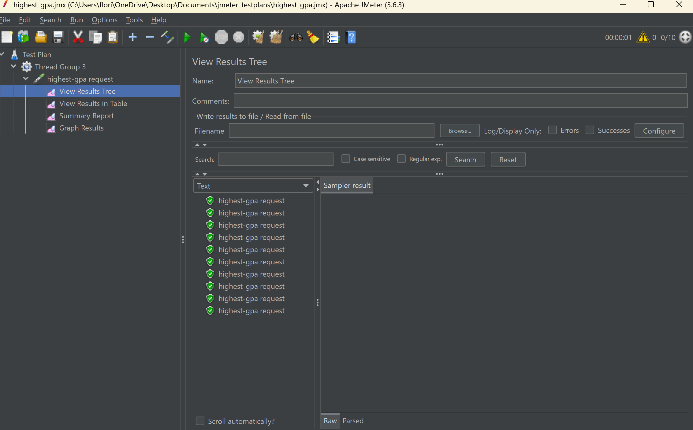

## JMeter Performance Testing Results After Refactor

### All-Student-Name Endpoint

| Before | After |
|--------|-------|
|  |  |
|  |  |

### Highest-GPA Endpoint

| Before | After |
|--------|-------|
|  |  |
|  |  |

### Test Result Logs: All-Student-Name

| Before | After |
|--------|-------|
|  |  |

### Test Result Logs: Highest-GPA

| Before | After |
|--------|-------|
|  |  |

### Get All Students and Courses

| Before | After |
|--------|-------|
|  |  |

#### **Conclusion:**

### Highest GPA

| Before | After |
|--------|-------|
|  |  |

#### **Conclusion:**

### Find All Students

| Before | After |
|--------|-------|
|  |  |

#### **Conclusion:**

## JMeter After Refactor: **All-Student Endpoint**

| Before | After |
|--------|-------|
|  |  |
|  |  |

## JMeter After Refactor: **All-Student-Name Endpoint**

| Before | After |
|--------|-------|
|  |  |
|  |  |

## JMeter After Refactor: **Highest-GPA Endpoint**

| Before | After |
|--------|-------|
|  |  |
|  |  |

### Reflection
#### What is the difference between the approach of performance testing with JMeter and profiling with IntelliJ Profiler in the context of optimizing application performance?
Load testing and performance testing are what JMeter is mainly used for, and it accomplishes these tasks by simulating a number of users and then analyzing the response times. In contrast, the IntelliJ Profiler is not a tool for overall system assessment, but rather for doing code-level profiling. It helps you determine which parts of your code are consuming CPU time, using excessive memory, or otherwise not operating efficiently. 

#### How does the profiling process help you in identifying and understanding the weak points in your application?
Profiling helps by providing live insights on CPU and memory usage, allowing us to identify performance bottlenecks, inefficient loops, etc. By analyzing method execution times, we can determine which parts of the code slow down the application and optimize accordingly.

#### Do you think IntelliJ Profiler is effective in assisting you to analyze and identify bottlenecks in your application code?
Yeah, it tells me which parts of my code are running too slow and what methods I have to fix to increase the overall performance of my application. I also get to see the specific difference in CPU time needed to run the application before and after code revisions now, which helps a lot with development.

#### What are the main challenges you face when conducting performance testing and profiling, and how do you overcome these challenges?
For me it was pretty hard to grasp the concept of performance testing and profiling at first, as there were so many listeners to check out and so many types of insights and graphs that could be provided by Jmeter and IntelliJ Profiler. Over time, I'm learning how to better understand these performance reports by asking my friends and also using resources on the Internet.

#### What are the main benefits you gain from using IntelliJ Profiler for profiling your application code?
I think it's very convenient to have a profiler built into IntelliJ as it means I don't have to do external set-ups with third party applications. The profiler also helps me find out where the bottlenecks of my application are at. It also aids me in evaluating the performance before and after I attempt to fix these bottlenecks.

#### How do you handle situations where the results from profiling with IntelliJ Profiler are not entirely consistent with findings from performance testing using JMeter?
When test results from a profiler differ from JMeter findings, I look first at the test environments. I check to see if any differences in configuration, deployment, or even underlying hardware could have caused the profiler to produce inaccurate results. I also closely inspect the dataset being used in the tests. 

#### What strategies do you implement in optimizing application code after analyzing results from performance testing and profiling? How do you ensure the changes you make do not affect the application's functionality?
After performance testing and profiling, I find out which method and functions are causing a bottleneck. Then, I try to make those methods and functions more efficient by using streams and appropriate database queries. To ensure changes don’t affect functionality, I rely on unit tests and integration tests.

